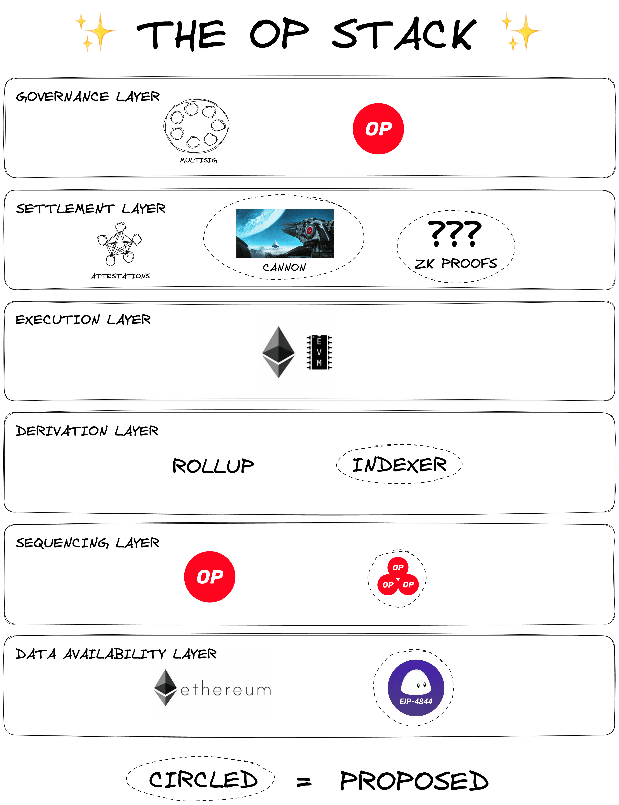
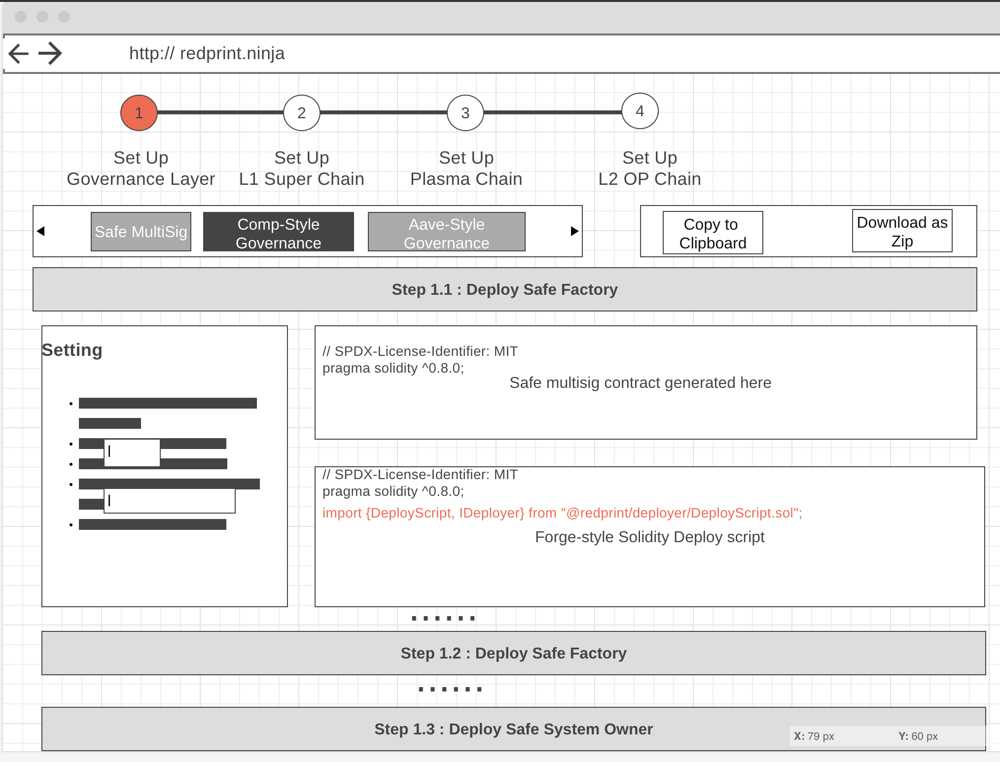

<h1>📚 POC : OPStack Contracts 's Deployment Pipeline using Redprint 📚</h1>

This repo shows how `Redprint` works. it includes a template experiment **OPstack** features. This can be done by modifying their smart contracts components using our [`Redprint Wizard`](https://github.com/Ratimon/redprint-wizard). Then, [`redprint-forge`](https://github.com/Ratimon/redprint-forge) could be used to deploy such customized contracts in production.

Hence, this acts an educational place to study OPStack component at smart contract level.

>[!NOTE]
> You can find our full code here for [`redprint-forge`](https://github.com/Ratimon/redprint-forge) and [`Redprint Wizard`](https://github.com/Ratimon/redprint-wizard). Everything is fully opensource from day one. 


- [What is it for](#what-is-it-for)
- [How It Works](#how-it-works)
- [Installation](#installation)
- [Quickstart](#quickstart)
- [Contributing](#contributing)
- [Architecture](#architecture)

## What is it for ?

This **OP-Stack-oriented App-chain** building block is intended to better introduce and onboard blockchain builder into Optimism 's [Superchain](https://docs.optimism.io/stack/explainer) Ecosystem.

>[!NOTE]
> **The OP Stack can be thought of as software components that either help define a specific layer of the Optimism ecosystem or fill a role as a module within an existing layer.**



You can check out details in different layers here : [Reference](https://docs.optimism.io/stack/components).

While developer experience and security are our top priorities, we aim to provide the developer-focused educational tool, such that the new experimental **Rollup** or **App-chain** can be quicky bootstapped in **superchain** community & ecosystem. This align with **Ethereum** 's Rollup-centric Roadmap.

## How It Works

`Redprint` consists of:

1. `Redprint Wizard` (**Web UI**)

We are building `Redprint Wizard`, a code generator/ interactive educational playground to customize, mix & match, deploy **OPStack** chain .

It supports spaces to experience, innovate and build features that either lie far along ether Optimism or Ethereum 's roadmaps which aren't yet available on the production at all. Then, the `Redprint` will generate all required solidity code, including both smart contract parts and their relevant deploy scripts. this empowers developers to dream, tinker, and push the boundaries of what's possible.

By way of illustration, this is a **low-fidelity wireframe** showing how it works:



It can be seen above that the developers have several options to choose their own desired layers. In our example above, it is step 1 of the **governance** Layer and the [`Safe's Multi-sig`](https://github.com/safe-global/safe-smart-account) is picked over other Governor-style contract systems.

To be more specific, another option is **Compound-style contract**. Different sets of parameters can be selected based on the preference. This includes **Voting Delay**, **Voting Period**, **Time Lock Period** and etc.

This is just one example. There are many other interesting customizable contracts to explore and add hackable features. For instance, customized bridge can be created by extending `IStandardard Bridge` as well as modifying `L1StandardBridge` or `L1ERC721Bridge`.

2. `redprint-forge` (**Framework**)

We are developing `redprint-forge`, a modular solidity-based framework to deploy OP stack smart contract. It works as an engine to:

- Provide type-safe deployment functions for **OPStack**'s smart contract component. This ensures correct type and order of arguments, enhancing security in smart contract development
- Save deployment schemas in **json** file
- Separate into each of modular and customizable components
- All-Solidity-based so no context switching, no new testing syntax

The directories below show how modular the `redprint-forge` 's **deployment system** is :

On the one hand, the first one is a set of deployment scripts written in [/script](./script), using `redprint-forge` library and style guide:

```sh
├── script
│   ├── 000_DeployAll.s.sol
│   ├── 101_DeploySafeProxyScript.s.sol
│   ├── 200_SetupSuperchain.s.sol
│   ├── 201A_DeployAddressManagerScript.s.sol
│   ├── 201B_DeployAndSetupProxyAdminScript.s.sol
│   ├── 202A_DeploySuperchainConfigProxyScript.s.sol
│   ├── 202B_DeployAndInitializeSuperchainConfigScript.s.sol
```

I highlight that developers are able to abstract and aggregate all scripts into just single one like in [/script](./script/000_DeployAll.s.sol):

```ts

/** ... */

// `redprint-forge` 's core engine
import {IDeployer, getDeployer} from "@redprint-deploy/deployer/DeployScript.sol";

/** ... */

// application-specific logic
import {DeploySafeProxyScript} from "@script/101_DeploySafeProxyScript.s.sol";
import {SetupSuperchainScript} from "@script/200_SetupSuperchain.s.sol";

contract DeployAllScript is Script {

    /** ... */

    function run() public {

        // a singleton global deployer that any deployment script can access
        deployerProcedue = getDeployer();
        // auto saving address schema in .json file
        deployerProcedue.setAutoSave(true);

        DeploySafeProxyScript safeDeployments = new DeploySafeProxyScript();
        SetupSuperchainScript superchainSetups = new SetupSuperchainScript();

        //1) set up Safe Multisig
        safeDeployments.deploy();
        //2) set up superChain
        superchainSetups.run();
        //3) TODO set up plasma
        //4) TODO set up layer2 OP Chain

    }
    /** ... */

}
```

>[!NOTE]
>The first digit represents the higher level of deployment logic, compared to the last degits. For example, `setup_200_superchain` whose number is `200` includes all of scripts whose numbers starting with `2XX` (e.g. `201A` or `deploy_201A_address_manager`).

>[!NOTE]
>You can also checkout how our implemented MVP of deployer library works as **a core engine** behind the scene here [Deployer.sol](./script/deployer/Deployer.sol)

On the other hand, the second one is the original script from **Optimism**'s [`Deploy.s.sol`](https://github.com/ethereum-optimism/optimism/blob/abfc1e1f37a89405bacd08a3bb6363250d3f68f5/packages/contracts-bedrock/scripts/Deploy.s.sol).

```sh
├── script
│   ├──
│   ├── Deploy.s.sol
│   ├──
```

As you can see, the original script is a single file, containing more than 1000 lines of code for all deployment logics for all contracts. Meanwhile, `redprint-forge` abstracts and separates them into modular components, enabling better readability.

Using together with `Redprint Wizard`, the generated solidity code which consists of both smart contract parts and their relevant deploy scripts are displayed in customizable ways, leading to better developer experience and creativity.

Furthermore, these deployment components are extremely re-usable to replicate the same environment when testing. This will speed up the development process, as the developer does not need to re-write deployment logics again in test suites.

As you can see in [ProxyAdmin.t.sol](./test/ProxyAdmin.t.sol), we can use those deployment components as a test harness.

```sh
├── test
│   ├──
│   ├── ProxyAdmin.t.sol
│   ├──
```

This could, together with **Type-Safe Deployment** feature, also improve overall security, because it potentially minimize false positives from using different deployment logics among production and test environments.

## Installation

[zellij](https://zellij.dev/) is a useful multiplexer (think tmux) for which we have included a [layout file](./zellij.kdl) to get started

Once installed, simply run:

1. Clone the repository:

```bash
git clone https://github.com/Ratimon/redprint-optimism-contracts-examples.git
```

2. Enter to the project directory:

```bash
cd redprint-optimism-contracts-examples
```

3. Select the correct node verison:

```bash
nvm use 18.17.0
```

4. Install the dependencies:

```bash
pnpm i
```

## Quickstart

1. Copy [`.env`](./.env) into `.env.<network>.local` and modify as required.


```sh
# -------------------------------------------------------------------------------------------------
# IMPORTANT!
# -------------------------------------------------------------------------------------------------
# USE .env.local and .env.<context>.local to set secrets
# .env and .env.<context> are used for default public env
# -------------------------------------------------------------------------------------------------

RPC_URL_localhost=http://localhost:8545

#secret management
MNEMONIC="test test test test test test test test test test test junk"
# local network 's default private key so it is still not exposed
DEPLOYER_PRIVATE_KEY=59c6995e998f97a5a0044966f0945389dc9e86dae88c7a8412f4603b6b78690d
DEPLOYER_ADDRESS=0x70997970C51812dc3A010C7d01b50e0d17dc79C8

# script/Config.sol
DEPLOYMENT_OUTFILE=deployments/31337/.save.json
DEPLOY_CONFIG_PATH=
CHAIN_ID=
IMPL_SALT=
STATE_DUMP_PATH=
SIG=
DEPLOY_FILE=
DRIPPIE_OWNER_PRIVATE_KEY=9000

# deploy-Config
GS_ADMIN_ADDRESS=0x70997970C51812dc3A010C7d01b50e0d17dc79C8
GS_BATCHER_ADDRESS=0x70997970C51812dc3A010C7d01b50e0d17dc79C8
GS_PROPOSER_ADDRESS=0x70997970C51812dc3A010C7d01b50e0d17dc79C8
GS_SEQUENCER_ADDRESS=0x70997970C51812dc3A010C7d01b50e0d17dc79C8
L1_RPC_URL=http://localhost:8545
```

>[!NOTE]
> More style and convention guide for environment variable management can be found here : [ldenv](https://github.com/wighawag/ldenv)


2. Run multi-windows terminal:

```sh
pnpm start
```

3. Run solidity deployment scripts:

These following commands will save deployment artifacts at [`deployments/<chain-id>/`](./deployments/.save.json)

There are two ways:

- Deploy each of individual components:

```bash
pnpm deploy_100_safe
```

```bash
pnpm deploy_201A_address_manager
```

```bash
pnpm deploy_201B_proxy_admin
```

- Alternatively, Deploy each set of contracts :

```bash
pnpm setup_200_superchain
```

or deploy all of them in single script:

```bash
pnpm deploy_000_all
```

4. Test your contracts

```bash
pnpm test
```

## Contributing

### Develop guide

Compile the non-default versions first:

```sh
FOUNDRY_PROFILE=oz_5_0_2 forge build
```

Compile the default version last:

```sh
forge build
```

## Architecture

WIP
